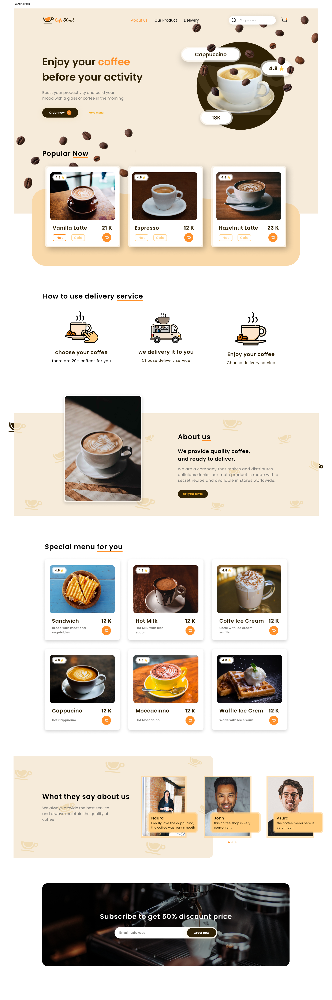

# Cafe Street Landing Page



A modern, high-performance Cafe Landing Page designed with a premium aesthetic. This project showcases a seamless user experience and pixel-perfect UI, built using the latest **Next.js 16**, **React 19**, and **Tailwind CSS v4** engine.

🌐 **Live Demo:** [https://cafe-street-landing-page.vercel.app/](https://cafe-street-landing-page.vercel.app/)

---

## 🚀 Tech Stack

This project leverages a "bleeding-edge" stack for maximum performance and developer efficiency:

* **Framework:** [Next.js 16 (App Router)](https://nextjs.org/)
* **Library:** [React 19](https://react.dev/) (utilizing the new **React Compiler**)
* **Styling:** [Tailwind CSS v4](https://tailwindcss.com/) (The all-new high-performance engine)
* **UI Components:** [Shadcn UI](https://ui.shadcn.com/) & Radix UI
* **Type Safety:** [TypeScript](https://www.typescriptlang.org/)
* **Animations:** `tw-animate-css` for smooth transitions
* **Icons:** Lucide React

## ✨ Key Features

* **Optimized Performance:** Fully leverages React 19's automatic memoization via the React Compiler.
* **Tailwind 4 Integration:** Clean implementation using the new CSS-first configuration and `@theme` variables.
* **Component-Driven Architecture:** Modular and reusable UI built with `class-variance-authority` (CVA).
* **Pixel-Perfect & Responsive:** Meticulously crafted to ensure a premium feel across mobile, tablet, and desktop devices.
* **Accessibility First:** Accessible components powered by Radix UI primitives.

## 🛠️ Getting Started

### Prerequisites

* Node.js 20.x or later
* npm / yarn / pnpm

### Installation

1.  **Clone the repository:**
    ```bash
    git clone [https://github.com/herihermansyah/cafe-street-landing-page.git](https://github.com/herihermansyah/cafe-street-landing-page.git)
    ```

2.  **Navigate to the project folder:**
    ```bash
    cd cafe-street-landing-page
    ```

3.  **Install dependencies:**
    ```bash
    npm install
    ```

4.  **Run the development server:**
    ```bash
    npm run dev
    ```

5.  Open [http://localhost:3000](http://localhost:3000) in your browser to see the result.

## 📂 Project Structure

```
├── public/          # Static assets & images
├── src/
│   ├── app/         # Next.js App Router (Pages, Layouts)
│   ├── components/  # Reusable UI & Business components
│   ├── hooks/       # Custom React hooks
│   └── lib/         # Utility functions & Shadcn configurations
├── tailwind.css     # Global styles & Tailwind v4 theme
└── package.json     # Project dependencies & scripts
```

Built with precision by [Heri Hermansyah](https://github.com/herihermansyah)
